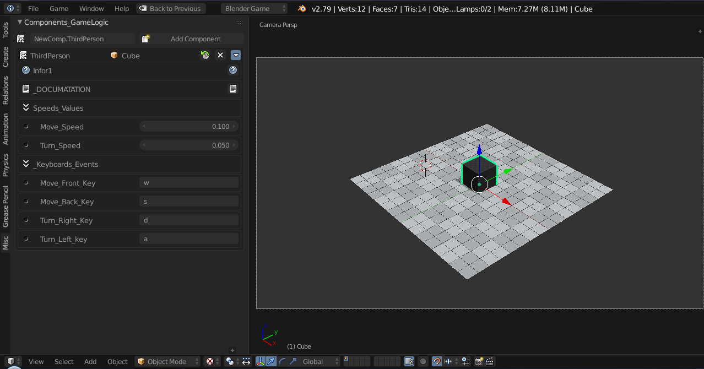

# BGE 2.79b Python Component System v0.2.1

> ### Python Component System v0.2.1
> 
>
>  Addon para o bge 2.79b, esse addon simula o sistema de python components utilizado no upbge, porém com algumas limitações mas que mesmo assim ajuda muito na hora de criar logicas no modo jogo.
> 
> Lembrando essa é um versão editada do addon, com novo visual e alguams funcionalidades adicionadas.

> - ---
>## Link 
> - [Addon python Component to BGE 2.79b original version ]( https://github.com/agoose77/bge_python_components.git )
> - ---

--- 
