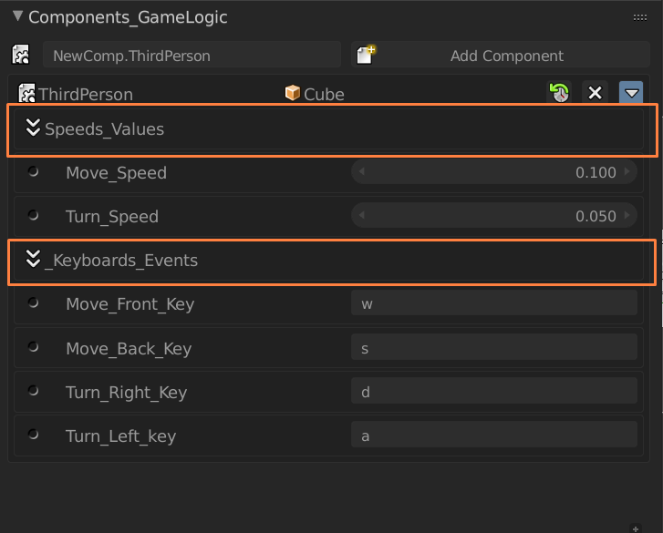
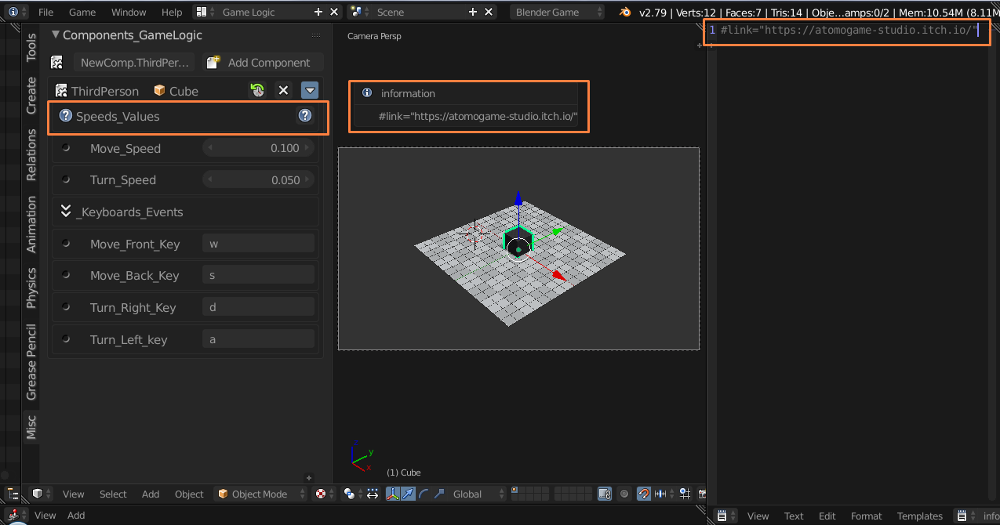

# BGE 2.79b Python Component System v0.2.1

> ### Python Component System v0.2.1
> 
>
>  Addon para o bge 2.79b, esse addon simula o sistema de python components utilizado no upbge, porém com algumas limitações mas que mesmo assim ajuda muito na hora de criar logicas no modo jogo.
> 
> Lembrando essa é um versão editada do addon, com novo visual e alguams funcionalidades adicionadas.
> - ----

> - ------------
>    import bge
>    from collections import OrderedDict
>
>
>    class ThirdPerson(bge.types.KX_PythonComponent):
>  
>        args = OrderedDict((
>
>                        ("@Speeds_Values",""),
>
>                        ("Move_Speed"           , 0.10),
>                        ("Turn_Speed"           , 0.05),
>                            
>
>                        ("@Keyboards_Events",""),
>
>                        ("Move_Front_Key"       , "w" ),
>                        ("Move_Back_Key"        , "s" ),
>                        ("Turn_Right_Key"       , "d"),
>                        ("Turn_Left_key"        , "a"),
>                        
>                        ))
>
> - ---
> Como pode ver no exemplo acima ao adicionar ( @ ) no inicio de algum args ele ira se tornar um separador no components fazendo assim uma melhor organização e separação de valores.
> - ----
> ### visualização 
> 
> - ---

> - ------------
>    import bge
>    from collections import OrderedDict
>
>
>    class ThirdPerson(bge.types.KX_PythonComponent):
>  
>        args = OrderedDict((
>
>                        ("@@Speeds_Values",""),
>
>                        ("Move_Speed"           , 0.10),
>                        ("Turn_Speed"           , 0.05),
> 
>                        ))
>
> - ---
> Como pode ver no exemplo acima ao adicionar ( @@ ) no inicio de algum args ele ira se tornar um novo separador no components porém com um button de informação que irar aparer as inafomrações em em texto que estiver no (  infor_components.py ) ao clicar irá aparecer um DialogMenu mostrando todo o texto.
> - -----
> ### Visualização
> 
> 

> - ---
>## Link 
> - [Addon python Component to BGE 2.79b original version ]( https://github.com/agoose77/bge_python_components.git )
> - ---

--- 

> -
> -